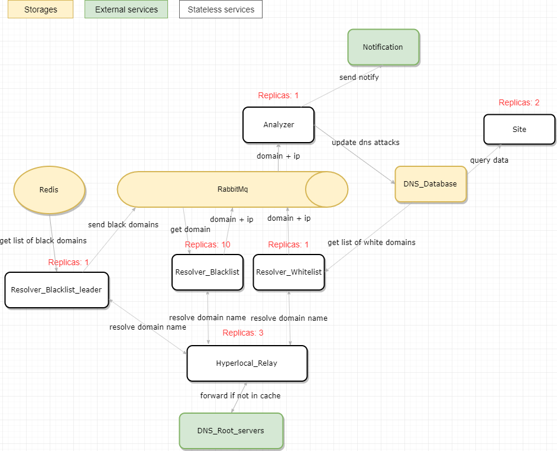

# Dns Analyzer

## Примерная архитектура DNS-анализатора  

## Dns.Resolver

### Configuration

`$HYPERLOCAL_SERVER` - имя сервиса DNS-Hyperlocal  
`$RESOLVER_BUFFER_BLOCK_SIZE` - Размер блока буфера  
`$RESOLVER_MAX_DEGREE_OF_PARALLELISM` - Число одновременных запросов к DNS-серверам  

### Описание

Работает в бесконечном цикле:
*  Получает список запрещенных доменов из Redis по ключу `Vigruzki_Domains`
*  Получает список белых доменов из PostgreSql `dnsdb.WhiteDomains`
*  Резовлит их IP с помощью [hyperlocal DNS-server](Hyperlocal/)
*  Сохраняет полученые данные в Redis по ключам `DNS_Resolver_Black` и `DNS_Resolver_White`
*  Делает Redis PUBLISH в канал `DNS_Resolve_Complete`
  
## Dns.Analyzer

### Configuration

`$ANALYZER_SUSPECT_IP_COUNT` - число IP-адресов у домена, при котором он считается "подозрительным"  
`$NOTIFICATION_EMAIL_FROM` - адрес почтового ящика с которого отправляются уведомления  

### Описание  
При старте делает Redis SUBSCRIBE по каналу `DNS_Resolve_Complete`, при получении сообщения:
*  Получает отрезовленные списки доменов из Redis по ключам `DNS_Resolver_Black` и `DNS_Resolver_White`
*  Обновляет список подозрительных доменов
*  Находит пересечения IP-адресов между `DNS_Resolver_Black` и `DNS_Resolver_White`
*  Исключает домены согласно таблице PostgreSql `dnsdb.DomainExcludedNames`
*  Обновляет информацию о DNS-атаках
*  Обновляет информацию об IP-адресах
*  Отправляет Redis PUBLISH в канал `Notification_Send_Message` готовое сообщение для отправки уведомлений

### Не реализовано
* [ Отправка уведомлений ]  На сайт
